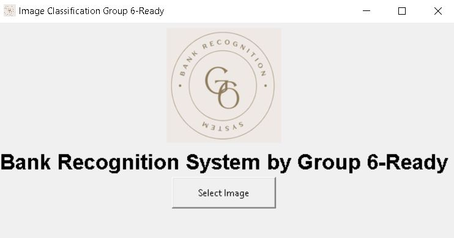
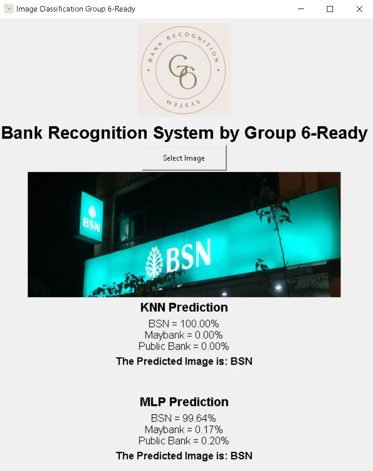
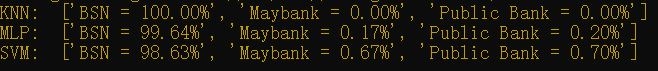

# Bank Recognition Classification
It is a short project of bank recognition classification using Machine Learning approach which include SVM, KNN, MLP and use Tkinter framework as UI.

# Dataset
Cropped image in respectively file in the All_images

# Code

**Label_from_images.ipynb** is to label the image and save it to the csv file for machine learning training purpose.

**Project_2_H5_File.ipynb** is to store the flatten images and label into h5 file.

**save_trainmodel_Pickle.ipynb** is to store the trained model into independent pickle file which help to use the model for prediction.

# Others
**Picture.h5** is the original dataset and labeled for training purpose.

**model_KNN.p** trained KNN model.

**model_MLP.p** trained MLP model.

**model_SVM.p** trained SVM model.

Run the script 
```
python assignment.py
```


### Result
The overview of the Tkinter UI



Select the image by clicking the button



Terminal result after predicting using machine learning


